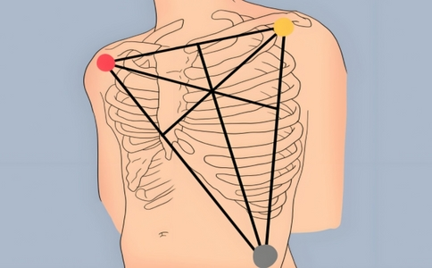

# 🩺 ESP32 ECG 自律神經檢測系統

基於 **ESP32 + AD8232** 的即時心電圖 (ECG) 擷取與自律神經 (HRV) 分析系統，支援手機 App 與 PC 端雙平台同步量測。

> [!WARNING]
> **⚠️ 免責聲明與非醫療產品聲明**
> 本專案為**非醫療級產品**，所有硬體設計、韌體、演算法與軟體生成的數據與分析報告**僅供學習、學術交流與個人研究開發使用**，不具備任何臨床醫療診斷、預防或治療之效力。若您身體感到不適，請務必尋求專業醫療機構及醫師的協助與診斷。

---

## 📸 系統架構

```
┌─────────────┐     BLE 藍牙      ┌──────────────────┐
│  ESP32 +    │ ◄──────────────► │  📱 手機 App      │
│  AD8232     │     250Hz        │  (React Native)   │
│  心電感測器  │                   └──────────────────┘
│             │     USB Serial    ┌──────────────────┐
│             │ ◄──────────────► │  💻 PC 端         │
└─────────────┘     250Hz        │  (Python + Web)   │
                                  └──────────────────┘
```

---

## ✨ 核心功能

* **Pan-Tompkins 自適應雙閾值 R 波偵測演算法**：自動校準訊號與噪聲閾值，支援回溯搜尋機制補償漏判。
* **訊號品質評估 (SQI)**：即時偵測雜訊干擾，自動啟用低通濾波平滑處理。
* **HRV 自律神經分析**：計算 SDNN、RMSSD、交感/副交感活性比例、神經活力分數。
* **ACLS 心電傳導間期分析**：PR 間期、QRS 波寬、QT 間期自動量測與診斷。
* **手機 App (React Native / Expo)**：BLE 即時連線、待機預覽波形、貼片脫落 (Leads-off) 自動偵測、自訂秒數量測、分離式高效波形儲存、橫向滑動 SVG 心電圖重播。
* **PC 端 (Python + Matplotlib + Web)**：支援 USB Serial/BLE 連線與動態波形繪製。

---

## 🔬 演算法與各項指標計算原理

本專案的核心分析演算法整合在 [ecgAnalyzer.js](file:///c:/Users/HP_600_G1_2ND/Desktop/自律神經檢測/mobile_app/src/utils/ecgAnalyzer.js) 之中，詳細處理步驟與計算公式如下：

### 1. R 波偵測：Pan-Tompkins 演算法

#### Step A: 數位濾波器 (Bandpass Filter)
將 250Hz 原始數據通過 5–15 Hz 的帶通濾波器，以濾除肌電噪訊 (EMG) 以及電極滑動引起的基線漂移：
$$H(z) = H_{low}(z) \cdot H_{high}(z)$$

#### Step B: 微分器 (Derivative)
使用五點差分法獲取波形的陡峭斜率資訊：
$$y(n) = \frac{1}{8} [2x(n) + x(n-1) - x(n-3) - 2x(n-4)]$$

#### Step C: 平方器 (Squaring)
將訊號平方以放大斜率能量，並強制將所有波形值轉為正值：
$$y(n) = [x(n)]^2$$

#### Step D: 移動積分窗口 (Moving Window Integration)
使用大約 150ms (37 個取樣點) 的移動窗口對能量進行平滑積分，形成清晰的能量峰：
$$y(n) = \frac{1}{N} \sum_{i=0}^{N-1} x(n-i)$$

#### Step E: 自適應雙閾值與回溯搜尋 (Back-Search)
1. 演算法維護兩個動態閾值：`Signal_Threshold`（心跳能量）與 `Noise_Threshold`（背景雜訊）。
2. 若波峰能量大於 `Signal_Threshold`，則判定為 R 波，並更新閾值：
   $$\text{Signal\_Threshold} = 0.125 \cdot \text{Peak\_Val} + 0.875 \cdot \text{Signal\_Threshold}$$
3. **回溯搜尋 (Back-Search)**：如果超過 1.66 秒（相當於心率低於 36 BPM）沒有偵測到 R 波，演算法會啟用次級閾值（即 `0.5 * Signal_Threshold`）在此區間回溯搜尋最大值，有效防止接觸不良時漏判。

---

### 2. HRV (心率變異度) 指標計算

經 R 波偵測後，可獲得相鄰心跳的時間差序列：**R-R 間期序列 ($RR_i$, 單位: ms)**。

#### 平均心率 (BPM)
$$\text{Heart Rate} = \frac{60000}{\text{Mean}(RR)}$$

#### SDNN (全部正常心跳間期的標準差)
反映自主神經系統的總體調節能力，數值越高代表身體調節適應力越強：
$$\text{SDNN} = \sqrt{\frac{1}{N-1} \sum_{i=1}^N (RR_i - \overline{RR})^2}$$

#### RMSSD (相鄰心跳間期差值的均方根)
主要反映副交感神經（迷走神經）的活性，數值高代表身體放鬆、副交感神經調節良好：
$$\text{RMSSD} = \sqrt{\frac{1}{N-1} \sum_{i=1}^{N-1} (RR_{i+1} - RR_i)^2}$$

#### 自律神經平衡度 (SNS vs PNS)
- **交感神經活性 (SNS%)**：基於 $\ln(\text{SDNN})$ 的相對佔比推估，高壓狀態下偏高。
- **副交感神經活性 (PNS%)**：基於 $\ln(\text{RMSSD})$ 的相對佔比推估，放鬆狀態下偏高。
- 平衡比例：$\text{Ratio} = \text{SNS} / \text{PNS}$，正常範圍為 40% ~ 60%。

---

### 3. ACLS 心電傳導間期量測

藉由鎖定的 R 波位置，向左與向右搜尋基準電位點與波谷，計算以下間期：
- **QRS 波寬**：心室去極化時間。計算 R 波起點至終點之時間差。正常範圍：$60 \sim 120\text{ ms}$。
- **PR 間期**：房室傳導時間。計算 P 波起點至 Q 波起點的時間差。正常範圍：$120 \sim 200\text{ ms}$。
- **QT 間期**：心室復極化時間。自 Q 波起點至 T 波終點的時間差。正常範圍：$350 \sim 440\text{ ms}$。

---

## ⚡ 實體硬體接線說明

### 1. AD8232 與 ESP32 接線對照表

| AD8232 腳位 | ESP32 腳位 | 說明 |
|-------------|-----------|------|
| **GND** | GND | 系統共同接地 |
| **3.3V** | 3.3V | 穩定 3.3V 電源輸入 |
| **OUTPUT** | GPIO 36 (VP) | ECG 類比訊號輸出，接 ESP32 ADC1_CH0 |
| **LO+** | GPIO 35 | Leads-off 偵測正極 (數位輸入) |
| **LO-** | GPIO 34 | Leads-off 偵測負極 (數位輸入) |

### 2. 實體接線圖 (請在此替換為您的實體線路照片)
```
[ 預留區：請在此上傳並貼上您的實體線路接線照片 ]
例如：
```

---

## 🔴 電極貼片位置說明

為取得高品質的心電訊號，建議採用**標準三電極（Einthorven I 導程）**配置貼附於胸口：


*(圖片來源：專案隨附電極貼片位置圖，基於臨床 AD8232 標準三電極配置建議)*

| 貼片顏色 | 標記 | 貼附位置 |
|:---:|:---:|---|
| 🔴 **紅色** | **RA** (Right Arm) | 右鎖骨正下方（靠近右肩） |
| 🟡 **黃色** | **LA** (Left Arm) | 左鎖骨正下方（靠近左肩） |
| 🟢 **綠色** | **LL** (Left Leg) | 左側下腹部（肋骨下緣，參考電極） |

---

## 🛠️ 技術棧與致謝用到的開源庫 (Libraries)

本系統開發過程中，特別感謝並致謝以下優秀的開源社群及軟體庫：

### 手機 App 端 (Mobile Client)
* **React Native / Expo** — 跨平台行動應用程式開發框架
* **react-native-ble-plx** (by Polidea/Dotscience) — 高性能低功耗藍牙 (BLE) 通訊庫
* **react-native-svg** — SVG 向量圖形渲染（用於即時與歷史心電波形繪製）
* **@react-native-async-storage/async-storage** — 本地鍵值持久化快取
* **expo-file-system** — Expo 原生文件系統管理庫（用於波形 CSV 與歷史大數據分離儲存）

### 電腦端 (PC Client)
* **Python 3** — 核心語言環境
* **Matplotlib** — 跨平台 2D 繪圖庫（用於即時波形示波器）
* **Bleak** — Python 跨平台低功耗藍牙 (BLE) 通訊庫
* **PySerial** — 序列埠通訊庫 (USB Serial 接收)
* **Numpy** — 科學計算與矩陣處理庫

### 韌體端 (Firmware)
* **PlatformIO & Espressif 32** — 嵌入式開發與燒錄生態系統
* **Arduino ESP32 BLE** (by Neil Kolban) — ESP32 C++ 藍牙通訊協議棧

---

## 🤖 AI 輔助開發

本專案在開發過程中，運用了 **AI 輔助開發工具** 加速迭代：
* **Google Gemini (Antigravity)** 與 **Claude (Anthropic)**：協助架構設計、數位訊號處理濾波算法編譯、React 狀態閉包除錯、分離式儲存系統優化以及完整專案技術文檔撰寫。
